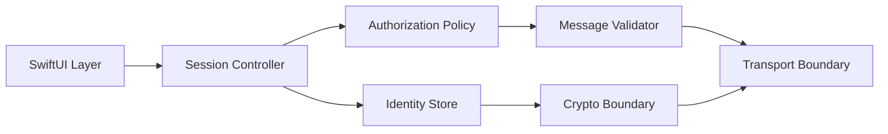

# OnyxKode Security Lab

> Defensive architecture research for secure mobile communication systems.

## Purpose

This repository extracts security engineering concepts from the broader OnyxKode idea into a public, reviewable laboratory.

It intentionally excludes production credentials, private infrastructure, secret material and deployable offensive tooling.

## Architecture model



## Included sample

`SecureMessageValidator` demonstrates defensive validation before a message is accepted into application state.

Validation covers:

- sender identity presence;
- payload size bounds;
- freshness window;
- empty payload rejection;
- explicit authorization callback.

## Trust model

```text
visible peer    != trusted peer
connected peer  != authorized peer
decoded data    != validated data
encrypted data  != authenticated identity
```

## Run tests

```bash
swift test
```

## Research boundaries

Authorized defensive research only. No third-party targeting, persistence, disruption or credential collection.

© 2026 Fran Gonzas