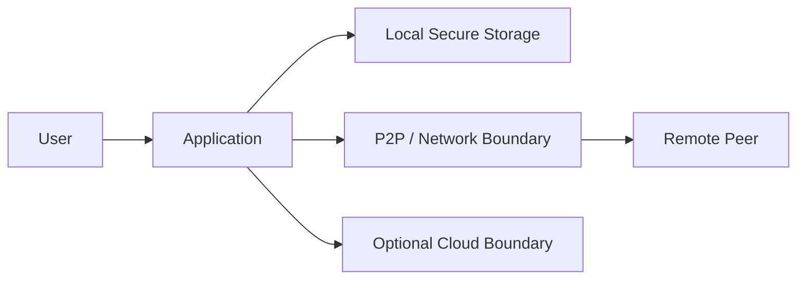

# Threat Model

## Assets

- local identity;
- authorization relationships;
- message confidentiality and integrity;
- session state;
- cryptographic key material.

## Trust boundaries

## Threats considered

- peer spoofing;
- malformed or oversized input;
- stale/replayed messages;
- accidental disclosure through logs;
- unauthorized peer state restoration;
- timeout and reconnection edge cases.

## Assumptions

Application-level controls cannot fully protect a device whose OS or unlocked local session is already compromised.